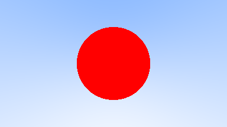

# Chapter 04

### Ray-Sphere Intersection

(x - Cx)2 + (y - Cy)2 + (z - Cz)2 = r2

<=> (**P** - **C**) &sdot; (**P** - **C**) = r2

<=> (**A** + t**b** - C) &sdot; (**A** + t**b** - C) = r2

<=> t2**b**&sdot;**b** + 2t**b** &sdot; (A - C) + (A - C) &sdot; (A - C) - r2 = 0

### Output Display

A simple red sphere

