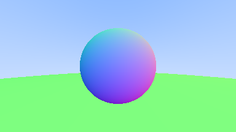

# Chapter 05

### Surface Normals

### Simplifying Intersection Calculation

Let , then:

 <=> 

### Possible directions for sphere surface-normal geometry

### Output Display

A  normals-colored sphere with ground

