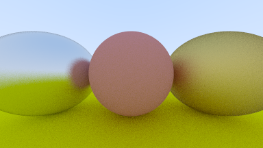

# Chapter 08

### Ray reflection

The reflected ray direction in red is just `V - 2 * (V * N) * N` (from `V + 2B`).

### Generating fuzzed reflection rays

Randomize the reflected direction by using a small sphere and choosing a new endpoint for the ray.

### Output Display

Metal sphere(fuzz 0.3), lambertian sphere, metal sphere(fuzz 1.0) with ground.

