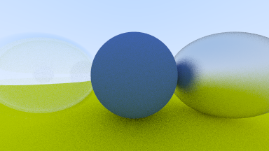

# Chapter 09

### Snell's Law


Split the refracted ray , we get:

​	%20=%20\frac{\eta}{\eta%27}%20(\mathbf{R}%20+%20(\mathbf{-R}%20\cdot%20\mathbf{n})%20\mathbf{n}))

​	


Because  shoud not be > 1.0, if a solution does not exist, all the rays must be reflected.


### Schlick Approximation

```cpp
double schlick(double cos, double refIdx) {
	double r0 = (1.0 - refIdx) / (1.0 + refIdx);
	r0 = r0 * r0;
	return r0 + (1 - r0) * pow((1 - cos), 5);
}
```


### Modeling a Hollow Glass Sphere

An interesting and easy trick with dielectric spheres is to note that if you use a negative radius, the geometry is unaffected, but the surface normal points inward. This can be used as a bubble to make a hollow glass sphere.


### Output Display

A hollow glass sphere, a lambertian sphere, a metal sphere with ground.



