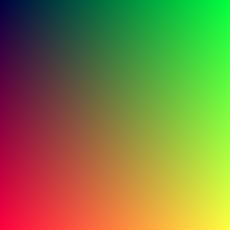
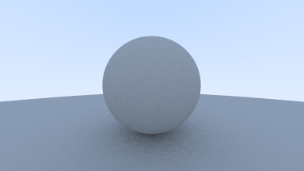
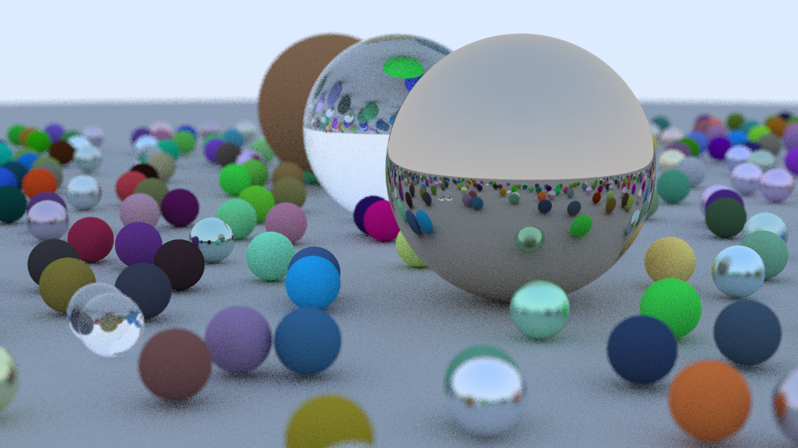

# Ray Tracing in One Weekend

### Chapter 01 Output an Image

### Chapter 02 The vec3 Class

### Chapter 03 Rays, a Simple Camera, and Background

### Chapter 04 Adding a Sphere

### Chapter 05 Surface Normals and Multiple Objects

### Chapter 06 Anti-aliasing

### Chapter 07 Diffuse Materials

### Chapter 08 Metal

### Chapter 09 Dielectrics

### Chapter 10 Positionable Camera

### Chapter 11 Defocus Blur

### Chapter 12 Cover Scene

