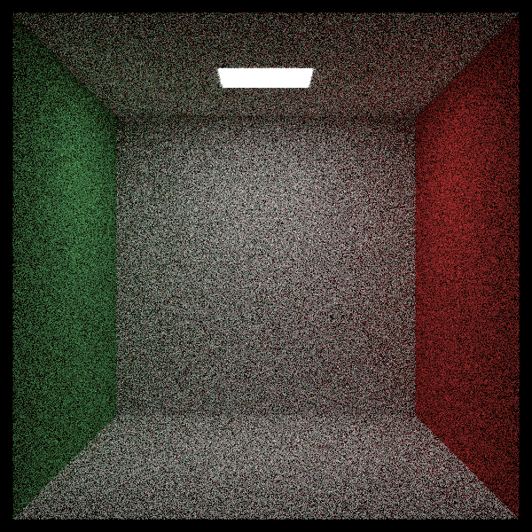

# Chapter 06

### Ray-rectangle intersection

Recall that a ray %20=%20\mathbf{A}%20+%20t%20\mathbf{b}) has its z component defined by %20=%20A_z%20+%20t%20b_z). Rearranging those terms we can get  where .

Once we have t, we can plug that into the equations for x and y: , 

It is a hit if  and .

### Output Display

Cornell box

